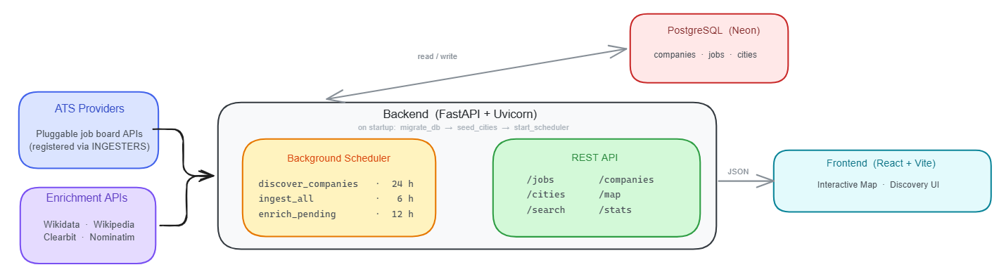

<p align="center">
  <picture>
    <source media="(prefers-color-scheme: dark)" srcset="frontend/public/logo-dark.svg" />
    
  </picture>
</p>

<p align="center">
  <a href="https://github.com/areebahmeddd/jobdex/releases"></a>
  <a href="LICENSE"></a>
</p>

<br />

JobDex is a startup-focused job board built around map-first discovery. Instead of starting with a search box and scrolling through pages of listings, users explore opportunities geographically, browsing jobs by city, region or remote status on an interactive map. [Demo Video](https://youtube.com/watch?v=dQw4w9WgXcQ)

> Open source alternative to [nextdoor.company](https://nextdoor.company) and [thejobsmap.com](https://thejobsmap.com)

## Architecture

<p align="center">
  
</p>

## Data Sources

### Integrated (Total: 12)

| ATS                                                              | Region    | Endpoint                                                         |
| ---------------------------------------------------------------- | --------- | ---------------------------------------------------------------- |
| [Ashby](https://ashbyhq.com)                                     | Global    | `api.ashbyhq.com/posting-api/job-board/{slug}`                   |
| [Greenhouse](https://greenhouse.io)                              | Global    | `boards-api.greenhouse.io/v1/boards/{slug}/jobs`                 |
| [Lever](https://lever.co)                                        | Global    | `api.lever.co/v0/postings/{slug}`                                |
| [SmartRecruiters](https://smartrecruiters.com)                   | Global    | `api.smartrecruiters.com/v1/companies/{slug}/postings`           |
| [Workable](https://workable.com)                                 | Global    | `apply.workable.com/api/v3/accounts/{slug}/jobs`                 |
| [Workday](https://workday.com)                                   | Global    | `{tenant}.{wd}.myworkdayjobs.com/wday/cxs/{tenant}/{board}/jobs` |
| [Rippling](https://rippling.com)                                 | Global    | `api.rippling.com/platform/api/ats/v1/board/{slug}/jobs`         |
| [YCombinator](https://ycombinator.com)                           | USA       | `api.ycombinator.com/v0.1/companies?q={slug}`                    |
| [Recruitee](https://recruitee.com)                               | Europe    | `{slug}.recruitee.com/api/offers/`                               |
| [Teamtailor](https://teamtailor.com)                             | Europe    | `{slug}.teamtailor.com/jobs.json`                                |
| [PyjamaHR](https://pyjamahr.com)                                 | India     | `api.pyjamahr.com/api/career/jobs/?company_slug={slug}`          |
| [MCF](https://mycareersfuture.gov.sg)                            | Singapore | `api.mycareersfuture.gov.sg/v2/jobs?company={slug}`              |

Every source is zero-auth: no API key, no token, no signup.

### Planned

| ATS                                              | Region | Blocker                                                                                                     |
| ------------------------------------------------ | ------ | ----------------------------------------------------------------------------------------------------------- |
| [SEEK](https://seek.com.au)                      | AU/NZ  | Zero-auth and filterable per advertiser, but bot-protected and keyed by an unlistable numeric advertiser ID |
| [Kalibrr](https://kalibrr.com)                   | PH/ID  | Endpoint is zero-auth JSON and compatible, but every live board reports zero open listings                  |
| [NHS Jobs](https://jobs.nhs.uk)                  | UK     | Needs a free Azure APIM subscription key, and its search-based model does not fit the slug-based ingester   |

> For a full compatibility matrix including researched but incompatible platforms, see [ATS Integrations](docs/PLAN.md#ats-integrations) in PLAN.md.

## Live Deployment (Production)

| Service      | URL                                  |
| ------------ | ------------------------------------ |
| Frontend UI  | <https://jobdex.1mindlabs.org>       |
| Backend API  | <https://jobdex-api.1mindlabs.org>   |

## Getting Started (Locally)

```bash
git clone https://github.com/areebahmeddd/jobdex
cd jobdex
docker compose up
```

- Frontend UI: `http://localhost:3000`
- Backend API: `http://localhost:8000`
- API docs: `http://localhost:8000/docs`

## Documentation

- [backend/README.md](backend/README.md): API setup and configuration
- [frontend/README.md](frontend/README.md): Frontend setup and development
